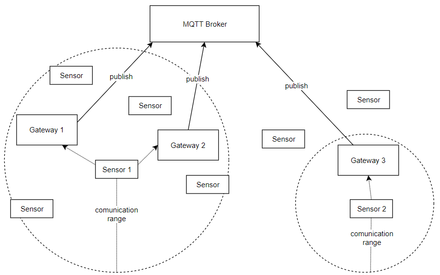
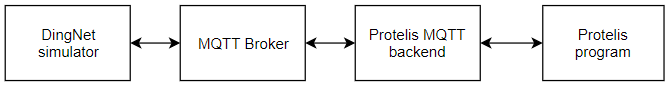
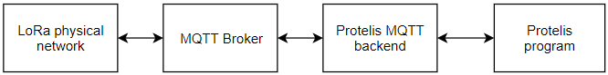
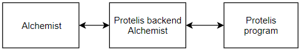

# AC-and-DingNet

## Description case study
The aim of the project is realize a pervasive real-time system for smart-city.
The system will use real-time data to create a city map of quality air.
The application will use the map to define a route to a destination that avoid areas with poor air quality.
Data can be produced by two types of sensors:

- **Fixed**: positioned along the roads and at intersections
- **Mobile**: placed on public transport or bicycles

Sensors will use DingNet network to communicate their sensed data. DingNet is a network LoRa-over-MQTT where every device send data to all the gateways inside the communication range. Then the gateways publish sensors data on MQTT server for the application, like the following image.

## System structure

The system will be composed from 4 principles building block, (see image below):

1. **DingNet simulator** (to evolve) -> simulates the sensors network scattered around the city, that communicate sensed data to the gateways of DingNet network emulating LoRa communication. The gateways then publish data on a MQTT server.
0. **MQTT broker** (already present) -> intermediary between the sensor/actuator network and Protelis program.
0. **Protelis MQTT back-end** (to do) -> entry point of Protelis program. The back-end hides the real network topology, so the Protelis program can use a logical proximity based network. In this case the communication will be based on MQTT.
0. **Protelis program** (to do) -> the aggregate program that identifies areas with good air quality and defines the required routes

The communication between the DingNet simulator and the Protelis program is bi-directional.

## Road Map

The necessary steps to obtain the system are the following:

1. design and implement the building block "Protelis MQTT backend". It require to:
    - implement the communication between the DingNet network and the Protelis program
    - implement communication between Protelis nodes
    - define a neighborhood policy
1. modify the DingNet simulator in order to:
    - use real MQTT server and not the mock one
    - fix some bug in the simulator
    - define a function to generate sensors data in a spatio-temporal domain to control where and when we will have areas with poor air quality
    - actually are only present fixed and mobile sensors. So it will be necessary define a new kind of entity that can require and follow a route.
    - add support for mobile sensors with delayed start, now they start to move at the beginning of the simulation
1. realize the Protelis program
1. realize the same program with A*-search to evaluate the different solutions

## Why is this system a valid simulator for the real system?

This system is a valid simulator for the real system because the building block "DingNet simulator" emulate a real LoRa-over-MQTT network. We can put the real network instead of this building block and all the messages published on the MQTT broker will be consistent with the simulated network, so all the system continue to work as with the simulated network and no other change are required.
The structure of the real system is visible in the following image:

## Validate the Protelis program on Alchemist simulator

In order to validate the Protelis program in large-scale scenarios or in particular situations is possible to test the program in a another simulator: [Alchemist](https://alchemistsimulator.github.io). Alchemist is a stochastic simulator that support the execution of Protelis programs providing an implementation for the required back-end.
In this case the structure of the system will be different (see image below) because we don't have a MQTT server were the sensors data are published by the sensor network, but the Protelis program will be the same.

