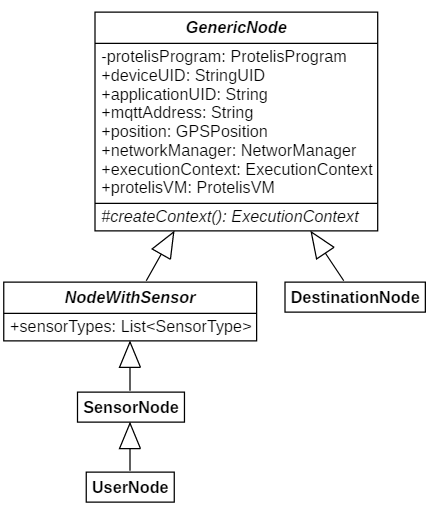
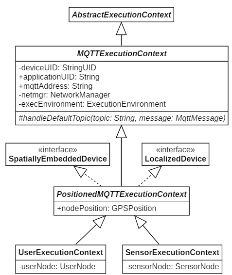
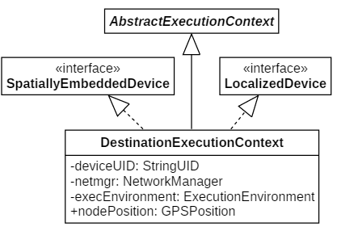

# AC backend architecture

In this application we have three different typology of nodes with different capabilities:

- *SensorNode* -> represent a sensor device with sensing capabilities
- *UserNode* -> represent a user device. It can request for a path and it is also possible that it can have sensing capabilities
- *DestinationNode* -> represent the destination of the required path. It **don't** have physical counterpart.

The following image is a diagram of node modeling:

A protelis backend require to define for every kind of node:

- ExecutionContext
- NetworkManager

## Execution context

The modeling of the execution context for *SensorNode* and *UserNode* is the following and below explained

- *MQTTExecutionContext* -> encapsulates the subscription to the MQTT server where the physical counterpart will publish its data
- *PositionedMQTTExecutionContext* -> implements all the methods of the two interface for spatial capabilities
- *SensorExecutionContext* and *UserExecutionContext* -> implements the specific capabilities of the two type of nodes

*DestinationNode* don't require to comunicate via MQTT with the physical counterpart (becuase there is not any physical counterpart), so its ExecutionContext is more simple and implements only the two interface for spatial capabilities. Its UML schema is the following:

## Netwotk Manager
Currently the Network Manager is based on MQTT as it is already used for the Execution context
