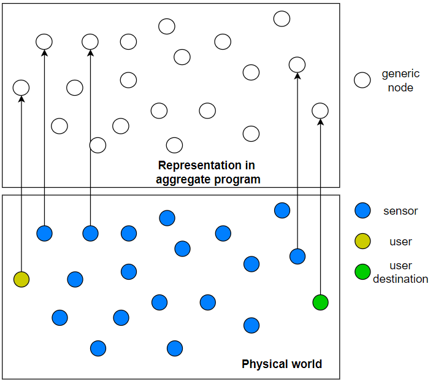

# How to apply Aggregate computing to this application

## Mapping between the two worlds
The mapping between physical world and aggregate program is the following:
- every sensor is a node of aggregate program (from now on: sensorN)
- every user is a node of aggregate program (from now on: userN)
- every user destination is a node of aggregate program (from now on: destinationN)

The following image is a rappresantation of this mapping:

Every node of the aggregate program retrieves the data of the physical counterpart from the MQTT server where it publishes them and can comunicate with the other nodes in its neighborhood.

## Creation of air quality map

From aggregate abstraction PoV, the idea is that sensorNs generate computional field in spatio-time domain that rapresent air quality level in that area.
It will be possible define different level of air quality to identify areas:
- to avoid
- to avoid if possible
- other ...

## Mobile sensor

It will be necessary define how to treat mobile sensors data, there are more possibilities:
 1. sensed data is valid until next data is sensed. All work as for fixed sensor, but when the sensor change position previous data are discarded.

 1. sensed data is valid for fixed period of time. Data last over time, but when the sensor change position it is necessary create temporary node in aggregate program to rapresent previous data.

 1. use advanced techniques to information decay like exponential backoff. Data last over time and and will not be necessary temporary nodes.

## Creation of route

The idea is that the user should avoid areas with poor air quality.
The route to destinationN will be a sequence of point composed from position of sensors in areas with acceptable air quality.
The composition of the path will emerge from the interaction between the nodes of the aggregate program, weighing routes with pollution level of the areas crossed.

How apply a maximum delta respect to shortest route is a problem still under investigation.
