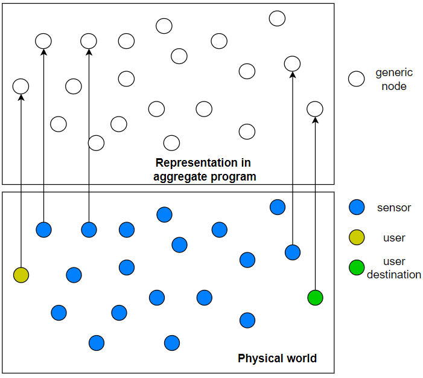

# How to apply Aggregate computing to this application

## Mapping between the two worlds
The mapping between physical world and aggregate program is the following:
- every sensor is a node of aggregate program (from now on: sensorN)
- every user is a node of aggregate program (from now on: userN)
- every user destination is a node of aggregate program (from now on: destinationN)

The following image is a rappresantation of this mapping:

Every node of the aggregate program retrieves the data of the physical counterpart from the MQTT server where it publishes them and can comunicate with the other nodes in its neighborhood. 

## Creation of air quality map

The idea is that each sensorN share their sensed data with their neighborhood to define air quality in that area.
It will be possible define different level of air quality to identify areas:
- to avoid
- to avoid if possible
- other ...

## Mobile sensor

It will be necessary define how to treat mobile sensors, there are at least two possibilities:
 1. sensed data is valid for fixed period of time. Data last over time, but when the sensor change position it is necessary create temporary node in aggregate program to rapresent previous data.
 2. sensed data is valid until next data is sensed or the sensor change position. All work as for fixed sensor, but when the sensor change position previous data are discarded.

## Creation of route

The idea is that areas with poor air quality are obstacles that the user cannot across.
The route to destinationN will be a sequence of point composed from position of sensors in areas with good air quality.
The composition of the route will emerge from interaction between the nodes of aggregate program and the distance between the nodes and the level of air quality will be considered.

How apply a maximum delta respect to shortest route is a problem still under investigation.
